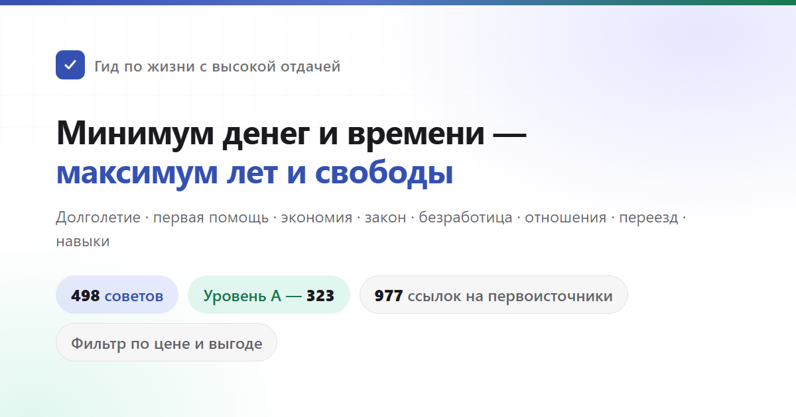

[中文](README.md) · **Русский**

<div align="center">



# Гид по жизни с высокой отдачей

Долголетие и профилактика болезней, несчастные случаи и первая помощь, экономия и личные финансы, защита от мошенников и юридические красные линии, поддержка при потере работы, риски бизнеса, легализация онлайн-платформ, отношения и дети, отъезд за границу и выбор навыков.<br>
498 советов — для каждого указано, чем приходится платить, что получаешь взамен и насколько надёжны доказательства; источники — только статьи в научных журналах и официальные документы.

[](https://eternity4719.github.io/HowToLiveBetter/)
[](#оглавление)
[](#градация-доказательности)
[](docs/核实记录/)
[](LICENSE)

**[Открыть страницу поиска](https://eternity4719.github.io/HowToLiveBetter/)** · [Оглавление](#оглавление) · [Глоссарий](#как-понимать-цифры-глоссарий) · [Записи проверки источников](docs/核实记录/) · [Стоит ли жениться (полный текст)](docs/结婚划不划算.md) · [Аптечка на случай ЧС (полный текст)](docs/家庭应急装备清单.md) · [Стоит ли останавливаться, если беда с незнакомцем (полный текст)](docs/遇到陌生人出事该不该停.md) · [Какие документы нужны для платформы (полный текст)](docs/做平台要办哪些证.md)

</div>

---

> **⚠️ Нейроперевод.** Этот README переведён с китайского языка нейросетью (ИИ, Claude) без дополнительной вычитки носителем языка — возможны неточности, особенно в юридических и медицинских формулировках. Перед тем как действовать на основании прочитанного, сверяйся с оригиналом и с источниками, указанными в строке «Источник» каждого пункта. Все цены, штрафы, номера горячих линий и ссылки на законы в тексте — китайские: эта книга описывает жизнь в КНР, а не в России или другой стране, переведён только язык, не страна действия. **Главы книги переводятся по очереди** и появляются в [book.ru/](book.ru/); то, что ещё не переведено (главы в [book/](book/) и развёрнутые материалы в [docs/](docs/)), остаётся на китайском. Интерфейс [страницы поиска](https://eternity4719.github.io/HowToLiveBetter/) тоже пока не переведён. Оригинал проекта: [eternity4719.github.io/HowToLiveBetter](https://eternity4719.github.io/HowToLiveBetter/).

## На какие вопросы отвечает этот гид

| Вопрос | Где искать |
| --- | --- |
| Что почти ничего не стоит, но заметно снижает риск ранней смерти? | [1. Как не умереть раньше времени](book.ru/01-как-не-умереть-раньше-времени.md) |
| Насколько курение, алкоголь, малоподвижность и недосып реально сокращают жизнь? | [2. Как не умирать медленно](book.ru/02-как-не-умирать-медленно.md) |
| Каждый день не хватает сил, постоянно всё прерывают — что с этим делать? | [3. Не тратить силы впустую](book.ru/03-не-тратить-силы-впустую.md) |
| Куда уходит время и как меньше заниматься бесполезным? | [4. Не тратить время впустую](book.ru/04-не-тратить-время-впустую.md) |
| Как хранить накопления, чтобы их не съели проценты, комиссии и мошенники? | [5. Не тратить деньги впустую](book.ru/05-не-тратить-деньги-впустую.md) |
| Какие БАДы, пакеты чекапов и прочий «налог на доверчивость» можно сразу не покупать? | [6. Список того, что выглядит выгодным, но на деле нет](book.ru/06-список-того-что-выглядит-выгодным-но-на-деле-нет.md) |
| Остался без работы, не платят зарплату, нет денег — что можно получить и куда обращаться? | [7. Как жить, когда нет денег](book.ru/07-как-жить-когда-нет-денег.md) |
| Кому по закону принадлежит выкуп за невесту, добрачная квартира, крупные переводы во время отношений? | [8. Право и имущественная безопасность](book.ru/08-не-подставь-сам-себя.md) |
| На тебя подали заявление или сфабриковали донос — что делать в первую очередь, можно ли потом добиться ответственности и компенсации? | [8. Право и имущественная безопасность](book.ru/08-не-подставь-сам-себя.md) |
| Какие «подработки» и мелочи превращают обычного человека в обвиняемого по уголовному делу? | [9. Юридические красные линии, в которые часто попадают обычные люди](book.ru/09-юридические-красные-линии.md) |
| Пытаться со многими сразу или упорно добиваться одного, получится ли роман на расстоянии, что нужно для регистрации брака? | [10. Стоит ли того любовь и брак](book.ru/10-стоит-ли-того-любовь-и-брак.md) |
| За какой код и за какие заказы можно получить уголовный срок? | [11. Красные линии для программистов и айтишников](book.ru/11-красные-линии-для-программистов.md) |
| Что важнее всего продумать перед тем, как занимать деньги на магазин или компанию? | [12. Бизнес и предпринимательство](book.ru/12-бизнес-и-предпринимательство.md) |
| Человек упал и не дышит, сильное кровотечение, пожар, потерялись — что делать в первую очередь? | [13. Экстренная ситуация: что делать в первую очередь](book.ru/13-экстренные-ситуации.md) |
| Взломали аккаунт, потерял телефон — что делать в первую очередь? | [14. Безопасность аккаунтов и данных](book.ru/14-безопасность-аккаунтов-и-данных.md) |
| Не возвращают залог, хозяин выгоняет, компания долгосрочной аренды обанкротилась — что делать? | [15. Аренда и покупка жилья](book.ru/15-аренда-и-покупка-жилья.md) |
| После диагноза хронического заболевания — как управлять этим годами и тратить меньше денег? | [16. Как жить с хроническим заболеванием](book.ru/16-жизнь-с-хроническим-заболеванием.md) |
| Как заранее оформить опеку, завещание и финансы для пожилых родителей? | [17. Если дома пожилые родители](book.ru/17-пожилые-родственники-в-семье.md) |
| Что положено при рождении ребёнка и сколько это отнимет времени и денег? | [18. Стоит ли заводить детей](book.ru/18-выгодно-ли-заводить-детей.md) |
| Как считать сверхурочные и отпуск, сколько положено при увольнении, как оформить травму на работе и получить выплаты? | [19. Работа, увольнение и производственная травма](book.ru/19-работа-увольнение-и-производственная-травма.md) |
| Что самое важное сразу после рождения ребёнка? | [20. Как ухаживать за новорождённым](book.ru/20-уход-за-новорождённым.md) |
| В какие страны сейчас лучше не ездить и чем реально может помочь посольство? | [21. Поездки и безопасность за границей](book.ru/21-выезд-за-границу-и-безопасность.md) |
| Как не попасть впросак в караоке, интернет-кафе, квеструме — и что реально помогает при сильном стрессе? | [22. Как расслабляться: досуг и снятие стресса](book.ru/22-как-расслабляться.md) |
| Учиться на сварщика, учить английский, получать сертификаты — что из этого реально окупается? | [23. Какие навыки стоит осваивать](book/23-学什么技能划算.md) |
| Насколько отличается стоимость лечения одной и той же болезни в районной поликлинике и в больнице третьего уровня? | [24. Как лечиться и меньше тратить](book/24-看病.md) |
| Тяжёлая травма — стоять в очереди на приём или сразу к сортировочной стойке приёмного покоя? Нужна ли потом экспертиза инвалидности? | [24. Как лечиться и меньше тратить](book/24-看病.md) |
| Умер близкий человек — что делать в первую очередь, какие деньги можно вернуть, за что можно не платить? | [25. Что нужно оформить после смерти близкого](book/25-人走了以后要办什么.md) |
| Хочешь сделать сайт или платформу с приёмом платежей — какие лицензии нужны и где размещать сервер? | [26. Как сделать сайт или платформу](book/26-做一个网站或平台.md) |
| Беременность и роды — что и когда делать, какие документы оформить перед выпиской? | [27. Беременность и роды](book/27-怀孕和生产.md) |
| Хочешь похудеть или стать красивее — какие способы реально портят здоровье? | [28. Не гробить здоровье ради внешности](book/28-别为了外形把身体搞坏.md) |
| Умер близкий, попал под сокращение, поставили тяжёлый диагноз — что важнее всего в первые месяцы? | [29. После тяжёлого удара судьбы](book/29-遭遇重大打击之后.md) |
| Ребёнок пошёл в школу — какие вопросы здоровья и психики нельзя откладывать до после экзаменов? | [30. Дети школьного возраста](book/30-上学以后的孩子.md) |
| После 18 лет — какие есть пути, кроме учёбы и подработки, и какие у них условия входа? | [31. Какие пути есть после 18 лет](book/31-十八岁之后有哪几条路.md) |

## Как читать

- **Хочешь фильтровать по условиям**: открой [страницу поиска](https://eternity4719.github.io/HowToLiveBetter/) — там можно фильтровать по ключевым словам, главам, уровню доказательности и трём измерениям затрат («деньги», «время», «сила воли»). Интерфейс сейчас на китайском (перевод ещё не сделан), данные он читает прямо из файлов в [book/](book/).
- **Хочешь читать по порядку**: внутри каждой главы пункты идут от самых выгодных к менее выгодным — можно начать с первых пунктов каждой главы.
- **Не разбираешься в статистике**: у каждого пункта есть строка «Простыми словами» — она переводит цифры из строки «Выгода» (отношения рисков, доверительные интервалы) на бытовой язык вроде «вероятность умереть в этот период ниже примерно на пятую часть» или «штраф такой-то, задержание на столько-то суток», используя только факты, которые уже есть в тексте, без новых цифр. Для решения достаточно этой одной строки; «Выгода» хранит все исходные цифры и доверительные интервалы для самостоятельной проверки.
- **Нужны только самые надёжные выводы**: на странице поиска отметь уровень доказательности A — останутся только 323 пункта с конкретными цифрами из метаанализов или крупных исследований.
- **Нужно только самое выгодное**: отметь класс отдачи «наивысший» — получится 85 пунктов, которые не стоят ни денег, ни времени, ни силы воли, а отдача при этом максимальная. Добавь фильтр «что получаешь взамен» — и получится приоритетный список по нужной тебе метрике.
- **Не пугайся названий глав, начинающихся с «не»**: заголовок главы описывает результат, которого она пытается избежать («не умереть раньше времени», «не тратить время впустую»), а не то, что каждый пункт внутри — запрет. Заголовок самого пункта — это конкретное действие, он всегда начинается с глагола и сам говорит, что делать или чего не делать — в одной и той же главе встречается и то и другое (например, в 4-й главе есть и «превратить намерение в конкретное время, место и триггер», и «не смотреть телевизор и ленту новостей»). Ориентируйся на заголовок пункта, а не на тон заголовка главы.

Каждый пункт выглядит так:

```markdown
### 5. Заменить обычную соль дома на соль с пониженным натрием (калиевую)
- Цена: на несколько юаней дороже за пачку
- Простыми словами: в рандомизированном испытании с 20 тысячами участников у тех, кто заменил обычную соль на соль с пониженным натрием, вероятность умереть в течение пяти лет была ниже примерно на 12%, а вероятность инсульта — примерно на 14%. Это результат случайного распределения по группам, поэтому ему стоит доверять больше, чем обычным наблюдательным данным.
- Выгода: инсульт ниже на 14%, сердечно-сосудистые события ниже на 13%, общая смертность ниже на 12%
- Уровень доказательности: A
- Источник: Neal B, et al. (2021). NEJM. https://doi.org/10.1056/NEJMoa2105675
- Заметка: Спорно. Не подходит людям с почечной недостаточностью и тем, кто принимает калийсберегающие диуретики. Есть и экологическое исследование по 181 стране, обнаружившее, что чем выше потребление натрия в стране, тем выше ожидаемая продолжительность жизни и ниже общая смертность (β = −131 случай на грамм суточного натрия, R² = 0,60, P < 0,001); авторы на этом основании возражают против того, чтобы считать натрий причиной сокращения жизни. Но экологическое исследование сравнивает страны, а не людей: в богатых странах едят больше соли и одновременно дольше живут, отделить это от уровня благосостояния (конфаундера) нельзя, поэтому доказательность здесь ниже, чем у рандомизированного исследования выше. Источник: Messerli FH, Hofstetter L, Syrogiannouli L, et al. (2021). Sodium intake, life expectancy, and all-cause mortality. European Heart Journal, 42(21), 2103-2112. https://doi.org/10.1093/eurheartj/ehaa947
```

## Четыре вида ресурсов

Этот гид оптимизирует не только продолжительность жизни, а сразу четыре ресурса:

- **Жизнь**: жить дольше, меньше умирать от того, чего можно было избежать
- **Время и силы**: чтобы прожитое время не уходило на бесполезное, а внимание и силы каждый день тратились не впустую
- **Деньги**: меньше тратить впустую, вкладывать туда, где отдача точно есть
- **Личная свобода**: не попасть под задержание или в СИЗО просто потому, что не знал, где проходит красная линия

Каждый пункт отвечает на два вопроса: чем платишь (деньги / время / силы / сила воли) и что получаешь взамен (изменение общей смертности / снижение риска конкретной причины смерти / экономия времени и сил / экономия денег / защищённость и личная свобода). Пункты отсортированы по отдаче на вложенное, а не по категориям: то, что почти ничего не стоит, но даёт много, стоит в начале.

**Кому засчитывается выгода — разделено на уровни.** По убыванию «ожидания, что эта польза когда-нибудь вернётся именно тебе»: ① **ты сам**; ② **супруг(а) и ближайшие родственники** (родители, дети, бабушки и дедушки, внуки); ③ **друзья, коллеги и другие родственники** — это взаимность, то, что отдал, может со временем вернуться; ④ **незнакомцы** — самый низкий уровень, но не ноль: вероятность отдачи мала, к тому же ты не знаешь характер человека — есть и оборотная сторона: тебя могут обвинить, подставить, отомстить. Уровни не складываются между собой; там, где речь о четвёртом уровне, польза и риски описаны вместе.

Главу о первой помощи стоит читать с поправкой на это: из 38 227 случаев внебольничной остановки сердца в Китае 79,2% происходят дома, так что осваивать непрямой массаж сердца в первую очередь имеет смысл ради своих. Правила вроде «увидел тонущего — сам в воду не лезь» или «увидел драку — не встревай» — это правила самозащиты в чистом виде: они не дают тебе из наблюдателя превратиться во второго пострадавшего. Вмешиваться ради незнакомца или нет — решение всегда твоё; в тексте прописаны и оговорки об ответственности, и действия по самозащите, и риски, но это не аргумент в пользу того, что вмешаться обязательно.

Цифры смертности, времени/сил, денег и юридических последствий считаются в разных единицах измерения и не переводятся друг в друга. Эти четыре ресурса соответствуют четырём фильтрам «что получаешь взамен» на странице поиска — между собой они не сравниваются.

## Градация доказательности

У каждого пункта указан уровень доказательности:

| Уровень | Значение |
| --- | --- |
| A | Есть измеримые доказательства из метаанализов, крупных когорт или РКИ — можно привести конкретные цифры (HR, RR, процент снижения) |
| B | Есть научные данные, но их сложно выразить числом, либо доказательства получены на маленькой выборке или из одного исследования |
| C | Личный опыт автора или общепринятое мнение без прямой ссылки на источник |

Из 498 пунктов книги 323 — уровня A, 126 — уровня B, 49 — уровня C; ещё 45 помечены как спорные, а в 39 местах стоит TODO «требует проверки». У спорных пунктов уровня A/B стоит пометка «спорно» и приведены контраргументы. Все источники — только первичная литература (статьи в журналах со ссылкой DOI или PubMed, либо отчёты официальных организаций вроде ВОЗ, CDC, статистических ведомств); пересказы из вторых рук не используются. Цифры, в которых нет уверенности, помечены как «требует проверки».

## Класс отдачи

Уровень доказательности отвечает на вопрос «можно ли доверять этой цифре», но не на вопрос «стоит ли это делать». Поэтому у каждого пункта дополнительно указаны масштаб отдачи и метрика — на странице поиска они вместе с тремя видами затрат складываются в общий класс «отдача на вложенное»:

| Параметр | Значения | Как определяется |
| --- | --- | --- |
| Метрика | жизнь / деньги / время и силы / личная свобода | по тому, что пункт в первую очередь даёт взамен. **Разные метрики между собой не сравниваются** — «общая смертность ниже на 12%» и «экономия 500 юаней в год» не измеряются одной линейкой |
| Масштаб отдачи | большой / средний / маленький | по возможности механически, по порогам из собственной строки «Выгода»: для жизни — по относительному снижению риска (≥20% — большой, 10–20% — средний, <10% или только суррогатная конечная точка — маленький); для денег — по сумме (от десятков тысяч юаней — большой, от сотен до нескольких тысяч — средний, несколько десятков юаней — маленький); для личной свободы — по последствиям (избежать уголовной ответственности — большой, избежать задержания или административного наказания — средний, избежать гражданского спора — маленький); для времени и сил — по объёму экономии (часы в день — большой, часы в неделю — средний, разовая экономия — маленький) |
| Отдача на вложенное | наивысшая / высокая / обычная | отдача большая и все три вида затрат нулевые = наивысшая; отдача большая при невысоких затратах, или отдача средняя при нулевых затратах = высокая; остальное = обычная |

Из 498 пунктов книги 88 (18%) имеют наивысшую отдачу на вложенное, 248 (50%) — высокую, 162 (33%) — обычную. То, что средняя категория самая многочисленная, — осознанный выбор: в основе лежит всего три градации масштаба отдачи, дробить точнее значило бы изображать точность, которой на самом деле нет.

**Этот класс — оценочное суждение автора, а не доказательство**, по сути это уровень C, и он не связан напрямую с уровнем доказательности. Пункт может быть уровня A, но при этом с обычной отдачей на вложенное (вакцина от опоясывающего лишая — РКИ третьей фазы с эффективностью 97,2%, но две дозы стоят три-четыре тысячи юаней, а сам опоясывающий лишай редко смертелен), а может быть уровня C, но с наивысшей отдачей (отправить родным маршрут поездки перед отъездом за границу). «Обычная» не значит «не стоит делать» — все пункты книги рекомендуется выполнять, просто в этом классе затраты придётся взвесить самому.

## Как понимать цифры (глоссарий)

Текст старается говорить простым языком, но при ссылках на исследования не обойтись без нескольких статистических терминов. Если что-то непонятно — смотри эту таблицу; на странице поиска (пока на китайском) наведение курсора или тап на слово с пунктирным подчёркиванием тоже показывает объяснение.

<details>
<summary>Раскрыть 40 терминов (общая смертность, HR, RR, 95% CI, метаанализ, BMI, LPR, задаток и аванс…)</summary>

| Термин | Значение |
| --- | --- |
| Общая смертность | Доля людей, умерших от любой причины за определённый период, независимо от того, от чего именно. В этой книге используется как мера «насколько долго живут». В первоисточниках — all-cause mortality, сокращённо ACM |
| HR | Отношение рисков (Hazard Ratio). Показывает, во сколько раз быстрее «что-то случается» (смерть, болезнь) в одной группе по сравнению с другой за одинаковое время. HR 0,87 значит риск ниже на 13% по сравнению с контрольной группой, HR 1,21 — выше на 21% |
| RR | Относительный риск (Relative Risk). Отношение вероятностей события в двух группах, читается так же, как HR |
| OR | Отношение шансов (Odds Ratio). Отношение «шансов» события в двух группах; при редких событиях близко к RR, при частых — завышает разницу |
| IRR | Отношение частоты заболеваемости, читается так же, как RR |
| RaR | Отношение числа случаев (например, падений), читается так же, как RR |
| SMR | Стандартизованное отношение смертности. Фактическое число смертей в группе, делённое на ожидаемое число, рассчитанное по смертности такого же возраста в общей популяции. 5,86 значит смертность в 5,86 раза выше, чем у сверстников |
| Разность рисков | Разница вероятностей события между двумя группами, выраженная напрямую — «на столько-то случаев больше на тысячу человек». Отношение показывает только «во сколько раз», а разность — абсолютное число дополнительных случаев |
| 95% CI | 95% доверительный интервал. Диапазон, в котором с высокой вероятностью лежит истинное значение. Если интервал для отношения захватывает 1, а для разности — 0, разница может быть случайной; в тексте это отмечается как «статистически незначимо» |
| RCT | Рандомизированное контролируемое исследование. Людей случайным образом делят на две группы — одной применяют вмешательство, другой нет — и сравнивают результат. Лучше всего показывает причинно-следственную связь |
| Метаанализ | Объединение результатов нескольких исследований в одну общую оценку |
| Когорта | Когортное исследование: наблюдение за группой людей на протяжении многих лет, чтобы увидеть, у кого что случится. Показывает связь, но не полностью доказывает причинность |
| Обсервационное | Наблюдательное исследование. Исследователи только наблюдают, не вмешиваясь; результат может зависеть от посторонних факторов и обратной причинности, поэтому к цифрам стоит относиться с поправкой |
| Конфаундер | Смешивающий фактор: третий фактор, который одновременно влияет и на «причину», и на «результат», из-за чего связь выглядит как причинность. Например, любители овощей чаще ещё и занимаются спортом |
| Обратная причинность | Не «A вызывает B», а «B вызывает A». Не долгий сон приводит к ранней смерти, а тяжелобольные люди больше спят |
| d, g | Величина эффекта (Cohen's d, Hedges' g). Разница средних значений двух групп, выраженная в стандартных отклонениях. 0,2 — маленький эффект, 0,5 — средний, 0,8 — большой |
| r | Коэффициент корреляции. Насколько два показателя меняются согласованно, от −1 до 1: 0,1 — слабая связь, 0,3 — средняя, 0,5 — сильная |
| MET | Метаболический эквивалент — единица интенсивности нагрузки. 1 MET — состояние покоя сидя, быстрая ходьба — примерно 3–4 MET. MET·ч — интенсивность, умноженная на часы |
| GRADE | Международный стандарт оценки качества доказательств: высокое, среднее, низкое, очень низкое |
| Анализ по intention-to-screen | Эффект считают по тому, «кого пригласили» на обследование, а не «кто реально его прошёл»; из-за этого эффект скрининга для тех, кто действительно прошёл его, занижается |
| Пачка-лет | Единица «стажа курения». Число пачек в день, умноженное на число лет курения: 30 пачка-лет — это пачка в день на протяжении 30 лет |
| BMI | Индекс массы тела. Вес (кг), делённый на квадрат роста (м) |
| LDL | Липопротеины низкой плотности — так называемый «плохой холестерин» |
| HBsAg | Поверхностный антиген гепатита B. Положительный результат означает, что человек уже заражён вирусом гепатита B |
| HPV | Вирус папилломы человека. Длительное носительство некоторых типов может привести к раку шейки матки |
| LDCT | Низкодозная КТ грудной клетки. Доза облучения примерно в 5–10 раз ниже, чем при обычной КТ |
| PM2.5 | Взвешенные частицы диаметром менее 2,5 микрометра |
| NOVA | Классификация продуктов по степени переработки; «ультрапереработанные продукты» — её четвёртая категория |
| LPR | Базовая ставка кредитования (Loan Prime Rate) — опорная ставка по кредитам в Китае, публикуется 20-го числа каждого месяца; на неё ориентируются и ипотека, и частные займы |
| Решение с одного арбитража — окончательное | По некоторым категориям трудовых споров решение трудового арбитража в Китае вступает в силу сразу, и работодатель не может оспорить его в суде |
| Общий коэффициент брачности / разводимости | Число зарегистрированных браков или разводов за год на тысячу человек. Отношение числа разводов к числу браков — это уже другой показатель, путать их не стоит |
| AED | Автоматический наружный дефибриллятор. Красный или жёлтый аппарат первой помощи, который часто встречается в общественных местах; после включения сам подсказывает голосом, что делать, и сам решает, нужен ли разряд |
| CPR | Сердечно-лёгочная реанимация. Ритмичные надавливания на грудную клетку при остановке сердца, чтобы кровь продолжала циркулировать |
| 3C-сертификация | Обязательная сертификация продукции в Китае (China Compulsory Certification). Товары из соответствующего перечня без этой маркировки нельзя выпускать в продажу |
| Регистрация ICP | Регистрация сайта или приложения в системе Министерства промышленности и информатизации КНР перед запуском |
| Многоуровневая защита (等级保护) | Система классификации защищённости информационных систем в Китае: по значимости системы устанавливается соответствующий уровень мер безопасности |
| GPL | Один из видов лицензий на открытый исходный код. Продукт, использующий такой код, при распространении обычно тоже должен раскрывать исходный код |
| Соглашение о неконкуренции | В течение определённого срока после увольнения нельзя устраиваться к конкурентам; компания обязана ежемесячно платить компенсацию, максимум 2 года |
| Заявленный капитал | Сумма, которую учредитель обязался внести при регистрации компании. После заявления её нужно реально внести в установленный законом срок — это не просто цифра для красоты |
| Задаток и аванс | В китайском праве это разные вещи: за задаток (定金) предусмотрена неустойка — сторона, нарушившая договор, теряет его или возвращает в двойном размере, максимум 20% от суммы договора; аванс (订金) — просто предоплата без неустойки |

</details>

## Оглавление

> Ниже — переведённые названия и краткое содержание всех 31 главы. Перевод самих глав идёт по порядку; готовые главы ссылаются на файлы в [book.ru/](book.ru/), остальные пока ведут на китайский текст в [book/](book/) — перевод в процессе.

1. [Как не умереть раньше времени](book.ru/01-как-не-умереть-раньше-времени.md) — внешние причины смерти, газ и отравления, вакцины, скрининг, психологические кризисы, аптечка на случай ЧС, тревожные признаки вроде крови в моче. Метрика: общая смертность или смертность от конкретной причины.
2. [Как не умирать медленно](book.ru/02-как-не-умирать-медленно.md) — курение и алкоголь, спорт, сон, питание, малоподвижность. Метрика: общая смертность или смертность от конкретной причины.
3. [Не тратить силы впустую](book.ru/03-не-тратить-силы-впустую.md) — сон, прерывания, многозадачность, усталость от принятия решений, «долги» в отношениях. Метрика: силы и время.
4. [Не тратить время впустую](book.ru/04-не-тратить-время-впустую.md) — бесполезные занятия, невозвратные издержки, прокрастинация, совещания, дорога до работы. Метрика: время.
5. [Не тратить деньги впустую](book.ru/05-не-тратить-деньги-впустую.md) — подписки, лотереи, проценты, страхование, комиссии фондов, накопительная пенсия, автостраховка, предоплата, продажи через блогеров, личный счёт в ОМС, обман детей и возврат их платежей. Метрика: деньги.
6. [Список того, что выглядит выгодным, но на деле нет](book.ru/06-список-того-что-выглядит-выгодным-но-на-деле-нет.md).
7. [Как жить, когда нет денег](book.ru/07-как-жить-когда-нет-денег.md) — помощь, пособия, поиск работы, жильё и еда, медицина, борьба за невыплаченную зарплату, как не вляпаться. Метрика: деньги и социальные гарантии.
8. [Не подставь сам себя: право и имущественная безопасность](book.ru/08-не-подставь-сам-себя.md) — ДТП, блокировка счёта при мошенничестве, дипфейки и подделка голоса, защита при обвинении и ложном доносе, вымогательство под видом заявления в полицию и где грань с законным требованием компенсации, конфликты и демонстративное насилие от отчаяния, порыв причинить вред и право близких на принудительную госпитализацию, что делать после травли в сети, выкуп за невесту, добрачное имущество, поручительство, защита от мошенников, срок исковой давности, статус «неисполнившего решение суда» и ограничения, ответственность владельца собаки без вины. Метрика: деньги и личная свобода.
9. [Юридические красные линии, в которые часто попадают обычные люди](book.ru/09-юридические-красные-линии.md) — слухи, оскорбление памяти героев, зарубежный контент (смотреть можно, репостить нельзя), распространение порнографии, подработка в отмывании денег, поддельные документы для кредита, вещи, упавшие с высоты, копии оружия, дроны, скрытая съёмка, законная передача ребёнка на воспитание и где грань с похищением и оставлением, азартные игры, дикое мясо. Метрика: личная свобода и деньги.
10. [Стоит ли того любовь и брак](book.ru/10-стоит-ли-того-любовь-и-брак.md) — стратегия поиска партнёра, красные линии преследования, сигналы интереса, качество отношений, отношения на расстоянии, порядок регистрации брака, медосмотр перед браком, счёт здоровья, счёт времени, счёт денег, покупка жилья родителями и общие долги супругов, цена выхода из отношений. Подробнее: [docs/结婚划不划算.md](docs/结婚划不划算.md).
11. [Красные линии для программистов и айтишников](book.ru/11-красные-линии-для-программистов.md) — читы, парсеры, скрипты для перехвата билетов, удаление базы, унос исходного кода с собой, заказная разработка, соглашения о неконкуренции, лицензии на открытый код, регистрация приложений. Метрика: личная свобода и деньги.
12. [Бизнес и предпринимательство: не проиграть последнее](book.ru/12-бизнес-и-предпринимательство.md) — стартовый капитал, личное поручительство, выбор формы бизнеса, регистрация, лицензии, налоговая отчётность, счета-фактуры, налоговое мошенничество, договоры, наём персонала, серийное производство, риски по поддельному товару и авторским правам на изображения, уход с рынка. Метрика: деньги и юридическая ответственность.
13. [Экстренная ситуация: что делать в первую очередь](book.ru/13-экстренные-ситуации.md) — остановка сердца, инсульт и инсульт заднего кровообращения, глазной инсульт, инфаркт, расслоение аорты, внезапная «громовая» головная боль, хроническая субдуральная гематома у пожилых, тромбоэмболия лёгочной артерии, сильное кровотечение, укусы, ожоги, анафилактический шок, эпилепсия, гипогликемия, удар током, угарный газ, отравление и химические ожоги, инородное тело в ране, шинирование при переломе, мошенничества, угрозы приватности, тепловой удар, пожар, утопление, потеря в безлюдной местности, переохлаждение, укус змеи, землетрясение, дикие животные, удар молнии, горная болезнь, клещи, вода в походе; а ещё — стоит ли вмешиваться: поднимать ли упавшего пожилого человека, что делать при виде драки, к кому идти с расходами после того, как помог и пострадал сам. Метрика: выживаемость и деньги, в последних пунктах — ещё и личная свобода.
14. [Безопасность аккаунтов и данных](book.ru/14-безопасность-аккаунтов-и-данных.md) — двухфакторная аутентификация, пароли, SIM-карта, потеря телефона, кража с банковской карты, устройства входа, минимально необходимые разрешения приложений, распознавание лица, право на доступ к данным и их удаление. Метрика: деньги и личные данные.
15. [Аренда и покупка жилья](book.ru/15-аренда-и-покупка-жилья.md) — залог, силовое выселение, посредник, принимающий платежи, эскроу-счета, «продажа не отменяет аренду», проверка права собственности, спецсчёт для сделки, комнаты-перегородки. Метрика: деньги.
16. [Как жить с хроническим заболеванием](book.ru/16-жизнь-с-хроническим-заболеванием.md) — приверженность лечению, межрегиональные расчёты по хроническим заболеваниям, хранение результатов обследований, не бросать лечение ради «народных методов», длительный рецепт, прикрепление к семейному врачу, скрининг осложнений. Метрика: общая смертность и деньги.
17. [Если дома пожилые родители](book.ru/17-пожилые-родственники-в-семье.md) — назначенное опекунство, форма завещания, счета и как о них говорить, мошенничество под видом инвестиций в старость и «обратной ипотеки», страхование долгосрочного ухода. Метрика: деньги и личная свобода.
18. [Стоит ли заводить детей](book.ru/18-выгодно-ли-заводить-детей.md) — пособия по уходу за ребёнком, декретный отпуск и пособие, защита «трёх периодов» (беременность, роды, кормление), счёт времени, счёт денег. Метрика: деньги и время.
19. [Работа, увольнение и производственная травма](book.ru/19-работа-увольнение-и-производственная-травма.md) — сверхурочные и норма рабочего времени, оплачиваемый отпуск, испытательный срок; информирование о профвредностях и три медосмотра, защита от пыли, шума и химии и право отказаться; компенсация N / N+1 / 2N, не увольняться «по собственному желанию», сохранять доказательства; сроки признания травмы производственной, если работодатель не платил взносы, экспертиза трудоспособности, выплаты при смерти на производстве. Метрика: деньги.
20. [Как ухаживать за новорождённым](book.ru/20-уход-за-новорождённым.md) — безопасный сон, первая прививка от гепатита B, вакцины нацкалендаря, грудное молоко и прикорм, температура воды для смеси, мёд, витамин K, признаки, при которых срочно к врачу, не трясти ребёнка, подгузники и крупные покупки. Метрика: младенческая смертность и деньги; конкретные бренды не рекомендуются — только проверяемые критерии выбора.
21. [Поездки и безопасность за границей](book.ru/21-выезд-за-границу-и-безопасность.md) — уровни предупреждений МИД, горячая линия 12308, границы консульской защиты, медицинская страховка и эвакуация за границей, мошенничество с «высокооплачиваемой работой» за рубежом, потеря документов, иностранные водительские права и Женевская конвенция, регистрация посредников, регистрация маршрута. Метрика: деньги и личная свобода. Списки стран с предупреждениями часто меняются — в тексте указано, где смотреть актуальную информацию, а не сам список.
22. [Как расслабляться: досуг и снятие стресса](book.ru/22-как-расслабляться.md) — запасные выходы, честные цены, красные линии по наркотикам, не брать угощение от незнакомцев, регистрация по паспорту в интернет-кафе, выбор места для квеструма; дозировка и формат физической нагрузки против депрессии, медитация, дыхательные практики, социальная изоляция, зелёные зоны. Метрика: первая половина — деньги и личная свобода, вторая — силы и общая смертность; между собой не сравниваются.
23. [Какие навыки стоит осваивать](book/23-学什么技能划算.md) — сначала о том, продолжать ли учиться (законный минимальный возраст найма, обязательное образование, срок образования и смертность среди взрослых, структура образования по переписи, бесплатное среднее профобразование и стипендии, каналы поступления по закону о профобразовании, как самому посчитать, что выгоднее — учиться или работать), дальше — как выбирать (отдача от образования, поддельные сертификаты, субсидируемое обучение, устойчивость к автоматизации, разряды и зарплата, где искать дефицитные профессии, короткие программы в приоритете). Метрика: деньги и время, один пункт — смертность. В Китае нет официальной подробной статистики зарплат по профессиям, поэтому конкретные цифры по специальностям не приводятся.
24. [Как лечиться и меньше тратить](book/24-看病.md) — ступенчатая система направлений, непрерывный расчёт порога оплаты при стационаре, разница в проценте возмещения между уровнями больниц, резерв записи в головной больнице, оценка необходимости лечения в другом регионе, сокращение обычного приёма в больницах третьего уровня, хранение истории болезни и снимков, опечатывание карты при споре, четырёхуровневая сортировка в приёмном покое, экстренная помощь при неплатёжеспособности или без документов, сроки экспертизы инвалидности после завершения лечения, категории и степени удостоверения инвалида. Метрика: деньги и время.
25. [Что нужно оформить после смерти близкого](book/25-人走了以后要办什么.md) — действия и заявление в полицию при обычной и не по естественной причине смерти, оформление и восстановление медицинского свидетельства о смерти, перевозка и хранение тела, кремация, вскрытие при споре о причине смерти в течение 48 часов, срок снятия с регистрации, базовый перечень ритуальных услуг и тарифы, нарушения в ценах, регистрация похоронных посредников, остаток на счёте жилищного фонда, куда обращаться за выплатами по травме на производстве и соцстраху, право близких родственников распоряжаться личными данными умершего. Метрика: деньги.
26. [Как сделать сайт или платформу: лицензии, регистрация и сервер](book/26-做一个网站或平台.md) — уголовные риски приёма платежей платформой без лицензии, разделение коммерческой и некоммерческой деятельности, лицензия на телеком-услуги с добавленной стоимостью и EDI, лицензия на сетевой культурный и аудиовизуальный контент, регистрация ICP и требования к хостинг-провайдеру, проверка продавцов и передача налоговых данных, модерация контента и приём жалоб, реальные имена, прямые трансляции и донаты несовершеннолетних, удаление по уведомлению, трансграничная передача данных, выбор сервера. Метрика: личная свобода и деньги. Подробнее: [docs/做平台要办哪些证.md](docs/做平台要办哪些证.md).
27. [Беременность и роды: от обнаружения беременности до выписки с документами](book/27-怀孕和生产.md) — фолиевая кислота, оформление карты матери и ребёнка и бесплатные обследования до 13 недель, бесплатный скрининг на ВИЧ, сифилис и гепатит B и профилактика передачи от матери к ребёнку, курение и алкоголь во время беременности, низкие дозы аспирина при высоком риске преэклампсии, скрининг на гестационный диабет, признаки, при которых нужно немедленно к врачу, что делать при отхождении вод, роды без боли, показания к кесареву сечению без медицинских причин, страхование материнства и регистрация родов в другом регионе, медицинское свидетельство о рождении, скрининг новорождённых и слуха, регистрация ребёнка в системе ОМС и прописка в течение месяца, осмотр на 42-й день после родов и скрининг послеродовой депрессии. Метрика: первая половина — смертность, вторая — деньги и время на оформление.
28. [Не гробить здоровье ради внешности](book/28-别为了外形把身体搞坏.md) — жёсткие диеты, голодание, переедание с последующей рвотой и расстройства пищевого поведения; лицензия клиники и квалификация ведущего врача в эстетической медицине, уголовная ответственность за незаконную медицинскую практику; опасные зоны при контурной пластике и риск слепоты; препараты для похудения с запрещённым сибутрамином; анаболические стероиды для набора мышечной массы; препараты для похудения и половые гормоны — только по рецепту и с регулярным контролем, не через интернет и не с самовольным повышением дозы; предварительная оценка при дисморфофобии. Метрика: смертность (включая слепоту, госпитализацию и другие исходы для здоровья), два пункта об эстетической медицине — ещё и личная свобода.
29. [После тяжёлого удара судьбы](book/29-遭遇重大打击之后.md) — окно риска инфаркта и инсульта в первые 24 часа — 30 дней после утраты близкого, первая неделя после тяжёлого диагноза, смертность после потери работы и что нужно оформить в первую очередь, «опасное» полгода после потери супруга, семьи повышенного риска после утраты близкого от суицида или насилия, как устроить ребёнка, если умер родитель, куда идти, если горе «застряло», не всем нужна консультация по переживанию горя, развод и раздельное проживание, горячие линии 12356 и 12355 и психологические консультации, не принимать необратимых решений в период острого стресса. Метрика: в основном общая смертность, два последних пункта — деньги.
30. [Дети школьного возраста](book/30-上学以后的孩子.md) — экстренные состояния, которые считаются на часы, и временное окно при перекруте яичка; не откладывать лечение с «окном возможностей» ради экзаменов (корсет при сколиозе); доказательства и обязательная процедура признания школьной травли; 2 часа на улице каждый день для профилактики близорукости; ключевые пункты ежегодного школьного медосмотра и наблюдение при отклонениях; скрининг депрессии 12–18 лет и разница со школьным психологическим тестированием; «вылечить близорукость» — незаконная рекламная формулировка; официальные нормы по сну, домашним заданиям, физкультуре и рейтингам; академический отпуск с сохранением места не более 1 года; циклоплегическая рефракция и интервалы повторных проверок; герметизация фиссур. Метрика: в основном смертность и исходы для здоровья, ещё есть по одному-два пункта про деньги и время.
31. [Какие пути есть после 18 лет](book/31-十八岁之后有哪几条路.md) — законные пороги для восьми путей: работа с 16 лет, армия с 18 до 22/24/26 лет, госслужба с 18 до 35 лет при среднем специальном образовании и выше, пожарный с 18 до 22 лет (для выпускников колледжей или отслуживших — до 24), военный гражданский персонал с 18 лет и потолком 35 лет для нижних должностей, открытый набор в госучреждения, ИП («дееспособный гражданин с возможностью вести дело»), самообразование без ограничений по возрасту, но не для студентов очного отделения. Пять пунктов про армию: постановка на воинский учёт до 31 октября онлайн и срочная служба 2 года, совместные санкции за уклонение после призыва, компенсация за обучение 20 000–25 000 юаней и сохранение места учёбы на 2 года, шесть условий трудоустройства и 30 дней на явку после самостоятельного трудоустройства, пенсия при увольнении в запас и стаж/соцстрах/налоговые льготы при открытии бизнеса. Остальные семь пунктов: целевой набор на госслужбу после программ базовой службы, зачисление в штат учителей по специальной программе после трёх лет, пожарные и военный гражданский персонал, восполнение диплома через самообразование/вечернее-заочное обучение/открытый университет, самостоятельные взносы в соцстрах и открытая прописка при гибкой занятости, страхование профессиональных рисков курьеров, которое платит платформа. Метрика: деньги и время, пункт про уклонение от службы — ещё и личная свобода.

Внутри каждой главы пункты идут от самой высокой отдачи к самой низкой. Заголовки глав описывают результат, которого глава пытается избежать, а делать пункт или нет — решает заголовок самого пункта. Развёрнутые материалы: [docs/家庭应急装备清单.md](docs/家庭应急装备清单.md) (аптечка на случай ЧС), [docs/做平台要办哪些证.md](docs/做平台要办哪些证.md) (документы для платформы), [docs/结婚划不划算.md](docs/结婚划不划算.md) (стоит ли жениться) и [docs/遇到陌生人出事该不该停.md](docs/遇到陌生人出事该不该停.md) (стоит ли останавливаться ради незнакомца). Ход проверки источников по каждому пункту записан в [docs/核实记录](docs/核实记录/).

Файл `index.html` в корне репозитория — это страница поиска: фильтрует пункты по ключевым словам, главам, уровню доказательности и измерениям затрат (деньги, время, сила воли), данные читает прямо из [README.md](README.md) (китайская версия) и файлов в `book/`. Интерфейс страницы пока не переведён.

## Текст книги

Китайский оригинал разбит по главам на 31 файл в [book/](book/). Русский перевод собирается в [book.ru/](book.ru/) — по одной главе за раз, в порядке оглавления; на момент последнего обновления переведена глава 1. Переходи по названиям глав в оглавлении выше: готовые ведут на русский текст, остальные — пока на китайский.
